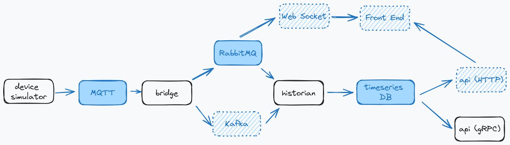

<a name="readme-top"></a>

<p align="center">
  <a href="https://skillicons.dev">
    
  </a>
</p>

<br />
<div align="center">
  
  <h1 align="center">Iot Project</h1>

  <p align="center">
    Projeto de estudo Back-end focando em tecnologias de IoT
  </p>
</div>

[](https://github.com/tinicius/iot-project/blob/main/README.md)
[](https://github.com/tinicius/iot-project/blob/main/README.pt-br.md)

  <summary>Sumário</summary>  
  <ol>
    <li>
      <a href="#sobre o projeto">Sobre o Projeto</a>
    <li>
      <a href="#getting started">Getting started</a>
      <ul>
        <li><a href="#pré-requisitos">Pré-requisitos</a></li>
        <li><a href="#instalação">Instalação</a></li>
        <li><a href="#testando a aplicação">Testando a aplicação</a></li>
      </ul>
    </li>
    <li>
      <a href="#serviços desenvolvidos">Serviços Desenvolvidos</a>
      <ul>
        <li><a href="#sensor simulator (nodejs)">Device Simulator (NodeJs)</a></li>
        <li><a href="#bridge (rust)">Bridge (Rust)</a></li>
        <li><a href="#historian (rust)">Historian (Rust)</a></li>
        <li><a href="#api (rust)">Api (Rust)</a></li>
      </ul>
    </li>
    <li>
      <a href="#progress">Melhorias Futuras</a>
      <ul>
        <li><a href="#apihttp">API HTTP</a></li>
        <li><a href="#kafka">Kafka</a></li>
        <li><a href="#websocket">WebSocket</a></li>
        <li><a href="#front">Front end (?)</a></li>
      </ul>
    </li>
    <li><a href="#conclusion">Conclusão</a></li>
  </ol>

## Sobre o Projeto

<figure>
    
    <figcaption>Oberservação: Os items pontilhados representam ideias futuras</figcaption>
</figure>

Este projeto tem como objetivo principal simular uma infraestrutura de Internet das Coisas (IoT), partindo da geração de dados por meio de um "sensor" simulado. Este sensor é uma aplicação desenvolvida para gerar dados aleatórios, emulando o comportamento de um dispositivo real. Os dados gerados são então transportados através do protocolo MQTT para um serviço de mensageria, no nosso caso o RabbitMQ.

Uma aplicação irá consumir os dados no serviço de mensagaria e os armazenar em um banco de dados Timeseries. Em nosso projeto, optamos por utilizar o AWS Timestream como nosso banco de dados.

Por fim, para tornar os dados disponíveis para consumo externo, desenvolvemos uma API utilizando gRPC. Esta API é responsável por acessar os dados armazenados no banco de dados Timeseries e responder às requisições dos clientes de acordo com suas necessidades específicas. 

Dessa forma, através dessa infraestrutura simulada, somos capazes de replicar o fluxo de dados típico de um ambiente IoT, desde a geração dos dados até a sua disponibilização para consumo externo através de uma API, demonstrando alguns conceitos e tecnologias envolvidas nesse ecossistema.

<p align="right">(<a href="#readme-top">back to top</a>)</p>

## Getting Started

Este guia demonstrará como instalar e executar o projeto em seu computador local de maneira simples e eficiente.

A nossa aplicação é distribuída através de contêineres Docker, proporcionando uma instalação facilitada dos pacotes e serviços externos necessários para o funcionamento do projeto.

Cada pasta dentro do projeto representa um serviço distinto, cada um desenvolvido independentemente e contendo o seu próprio Dockerfile. Para integrar e executar o projeto como um todo, utilizamos o Docker Compose. Este arquivo centralizado inclui as imagens de todos os serviços necessários para o funcionamento da aplicação.

### Pré-requisitos

#### Docker

Certifique-se de ter o Docker instalado em sua máquina. Se você ainda não o possui, pode baixá-lo e instalá-lo a partir do [site oficial do Docker](docker.com).

#### AWS Timestream

Nossa aplicação está configurada para gravar e consumir em um banco [AWS Timestream](https://aws.amazon.com/pt/timestream/). Assim, será necessário acesso a uma conta aws com esse serviço configurado.

Além de ativiar o serviço é preciso manualmente ciar um banco de dados chamado **iot-database** e duas tabelas: **data** e **status**.

Dentro do painel [AWS IAM](https://aws.amazon.com/pt/iam/) será preciso gerar as chaves de acesso que seram usadas pelo programa.

Após configurar as chaves de acesso, é necessário adiciona-las as variáveis de ambiente.

```
export AWS_ACCESS_KEY_ID=<your_acess_key_id> &&
export AWS_SECRET_ACCESS_KEY=<yout_secret_acess_key> && 
export AWS_DEFAULT_REGION=<your_default_region> 
```

### Instalação

O Docker será encarregado de criar uma nova imagem das aplicações e implementar nossa infraestrutura.

1. Clone the repo
   ```sh
   git clone https://github.com/tinicius/iot-project.git
   ```
2. Run docker compose
   ```sh
   docker compose -f "docker-compose.yml" up -d --build 
   ```

<p align="right">(<a href="#readme-top">back to top</a>)</p>

## Testando a aplicação

Para validar todo o fluxo em funcionamento é possivel acessar alguns endpoints que são expostos pela aplicação.

### MQTT

O topico raiz usado pelo projeto é *IoTProject/#*

```
HOST: localhost
PORT: 1883
USER: admin
PASSWORD: admin
```

### RabbitMQ

No RabbitMQ temos a exchange principal *IOT_PROJECT*

E também duas filas *TEMP* e *HUMIDITY*

```
HOST=localhost
PORT=15672
USER=guest
PASSWORD=guest
```

### API gRPC

Para acessar o api você irá precisar do arquivo [server.proto](https://github.com/tinicius/iot-project/blob/9d1da11972804a3c261826e70fd79679c12f528d/api/protos/server.proto)

O servidor está disponivel na rota *0.0.0.0:50051*

## Serviços Desenvolvidos

Vamos fazer uma pequena explicação de cada serviço desenvolvido falando sobre as caracteristicas de cada um, tecnologias utilizadas e observações importantes em cada cenário.

### Sensor Simulator (Node.js)
Esta aplicação serve como a base de nossa infraestrutura, simulando como dados reais gerados por diferentes dispositivos entram no ambiente da IoT. Para isso, simulamos a geração de dados aleatórios e os inserimos em nosso sistema, publicando-os utilizando o protocolo MQTT.

Desenvolvemos este serviço utilizando Node.js, com suporte a TypeScript. Essas tecnologias permitem um desenvolvimento rápido, aproveitando as bibliotecas comuns disponíveis. A linguagem JavaScript oferece funcionalidades úteis para nossa aplicação, como o método setInterval(), que possibilita a simulação do envio de mensagens em intervalos determinados.

O protocolo MQTT desempenha um papel fundamental no transporte de dados, permitindo a transmissão e recebimento de grandes volumes de dados com menor latência em comparação com outros protocolos. É uma maneira eficaz de enviar dados do mundo real para a internet, onde podem ser consumidos por outros serviços locais ou em nuvem.

Cada instância desta aplicação representa um único sensor. Ao iniciar, a aplicação gera um número aleatório que serve como identificador do sensor que está sendo simulado. Isso nos permite criar um projeto mais abrangente, lidando com diferentes tipos de dados enviados por diferentes dispositivos.

Um aspecto crucial dos dados da IoT é registrar não apenas a amplitude de uma medição, mas também o momento em que esses dados foram gerados. Portanto, em todos os dados enviados por nosso simulador, incluímos informações sobre o momento da geração desses dados.

Para evitar dados redundancias e diminuir o tamanho das mensagens enviadas pelo MQTT as informações que estão presentes no tópico não são adicionadas ao payload da mensagem.

Nossa aplicação irá simular três tipos de dados:

#### Serviços
Estes dados representam as medições que nosso sensor poderia realizar. Neste exemplo, implementaremos dois tipos: [0] Temperatura, [1] Umidade.

Os dados serão publicados no tópico MQTT IotProject/services/device/service_type.

Para temperatura, enviaremos valores aleatórios entre 10 e 100.

Para umidade, enviaremos valores aleatórios percentuais entre 0 e 1.

```
Temperatura | Humidade
Tópico MQTT: IotProject/services/device/<0 | 1>

{
  value: number,
  time: number
}
```

#### Status do sensor
Também simularemos dados que representam a saúde e o estado atual de um dispositivo. Para isso, enviaremos duas informações: a tensão da bateria e a intensidade de um sinal genérico. Esse sinal, em um dispositivo real, poderia representar informações da rede de internet, ethernet, bluetooth, entre outros.

Os dados serão publicados no tópico MQTT IotProject/status/device.

A tensão da bateria será um valor aleatório entre 0 e 5.

A intensidade do sinal será um valor aleatório entre 0 e 100.

```
Status
Tópico MQTT: IotProject/status/device/<0 | 1>

{
  batteryVoltage: number,
  signal: number,
  time: number
}
```

### Bridge (Rust)

Este programa em Rust tem como objetivo estabelecer a conexão entre o MQTT e nossos serviços de mensageria. Sua função principal é escutar as atualizações do MQTT e enviar os dados para o RabbitMQ.

É crucial utilizar um serviço de mensageria para garantir a consistência dos dados. O RabbitMQ desempenha esse papel armazenando os dados recebidos em diferentes filas. Esses dados são retidos até que o serviço receba a confirmação de que foram consumidos e processados corretamente.

Além disso, este serviço desempenha a função de transformar a estrutura dos dados, combinando as informações do payload com as informações recebidas. Essa transformação permite que os dados circulem de forma mais completa pelas camadas mais altas da aplicação.

```
Temperatura | Humidade
{
  time: u64,
  device: String,
  value: f32, 
  type: String,
}
```

```
Status
{
  time: u64,
  device: String,
  batteryVoltage: f32,
  signal: f32,
}
``` 

Configuramos o RabbitMQ com um exchange principal chamada **IOT_PROJECT**. Essa exchange recebe todos os dados e os distribui em três filas: **TEMP**, **HUMIDITY** e **STATUS**.


### Historian (Rust)

Caracteristicas
Tecnologias
Observacoes

### Api gRPC (Rust)

Caracteristicas
Tecnologias
Observacoes


<p align="right">(<a href="#readme-top">back to top</a>)</p>

<!-- LICENSE -->
## License

Distributed under the MIT License.

<p align="right">(<a href="#readme-top">back to top</a>)</p>

<!-- CONTACT -->
## Contact

Vinicius Alves Pereira


[](www.linkedin.com/in/dev-vini-pereira)


<p align="right">(<a href="#readme-top">back to top</a>)</p>

<!-- MARKDOWN LINKS & IMAGES -->
<!-- https://www.markdownguide.org/basic-syntax/#reference-style-links -->
[contributors-shield]: https://img.shields.io/github/contributors/othneildrew/Best-README-Template.svg?style=for-the-badge
[contributors-url]: https://github.com/othneildrew/Best-README-Template/graphs/contributors
[forks-shield]: https://img.shields.io/github/forks/othneildrew/Best-README-Template.svg?style=for-the-badge
[forks-url]: https://github.com/othneildrew/Best-README-Template/network/members
[stars-shield]: https://img.shields.io/github/stars/othneildrew/Best-README-Template.svg?style=for-the-badge
[stars-url]: https://github.com/othneildrew/Best-README-Template/stargazers
[issues-shield]: https://img.shields.io/github/issues/othneildrew/Best-README-Template.svg?style=for-the-badge
[issues-url]: https://github.com/othneildrew/Best-README-Template/issues
[license-shield]: https://img.shields.io/github/license/othneildrew/Best-README-Template.svg?style=for-the-badge
[license-url]: https://github.com/othneildrew/Best-README-Template/blob/master/LICENSE.txt
[linkedin-shield]: https://img.shields.io/badge/-LinkedIn-black.svg?style=for-the-badge&logo=linkedin&colorB=555
[linkedin-url]: https://linkedin.com/in/othneildrew
[product-screenshot]: images/screenshot.png
[Next.js]: https://img.shields.io/badge/next.js-000000?style=for-the-badge&logo=nextdotjs&logoColor=white
[Next-url]: https://nextjs.org/
[React.js]: https://img.shields.io/badge/React-20232A?style=for-the-badge&logo=react&logoColor=61DAFB
[React-url]: https://reactjs.org/
[Vue.js]: https://img.shields.io/badge/Vue.js-35495E?style=for-the-badge&logo=vuedotjs&logoColor=4FC08D
[Vue-url]: https://vuejs.org/
[Angular.io]: https://img.shields.io/badge/Angular-DD0031?style=for-the-badge&logo=angular&logoColor=white
[Angular-url]: https://angular.io/
[Svelte.dev]: https://img.shields.io/badge/Svelte-4A4A55?style=for-the-badge&logo=svelte&logoColor=FF3E00
[Svelte-url]: https://svelte.dev/
[Laravel.com]: https://img.shields.io/badge/Laravel-FF2D20?style=for-the-badge&logo=laravel&logoColor=white
[Laravel-url]: https://laravel.com
[Bootstrap.com]: https://img.shields.io/badge/Bootstrap-563D7C?style=for-the-badge&logo=bootstrap&logoColor=white
[Bootstrap-url]: https://getbootstrap.com
[JQuery.com]: https://img.shields.io/badge/jQuery-0769AD?style=for-the-badge&logo=jquery&logoColor=white
[JQuery-url]: https://jquery.com
